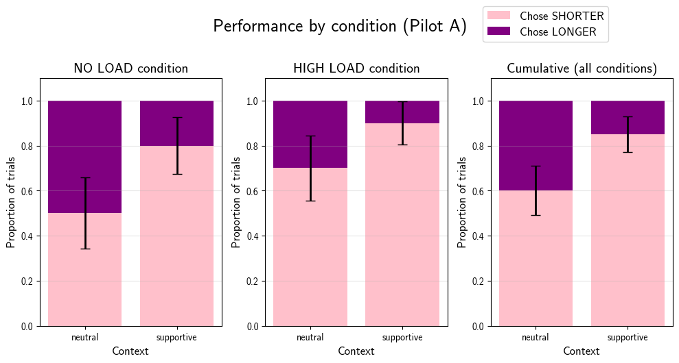

<!-- Replication reports should all use this template to standardize reporting across projects.  These reports will be public supplementary materials that accompany the summary report(s) of the aggregate results. -->


## Introduction

This is a replication report for the behavioral study in the paper Mahowald, K., Fedorenko, E., Piantadosi, S. T., & Gibson, E. (2013) Info/information theory: Speakers choose shorter words in predictive contexts. Cognition, 126(2), 313–318.

This study builds off of the psycholinguistic literature on communicative efficiency and asks whether shorter (or more ambiguous) forms of the same word are preferred in certain predictable contexts. It focuses on content word pairs (e.g. exam vs examination) to test whether speakers actively tune production based on information content. While the original article included a corpus study and a behavioral study, this replication focuses on the behavioral study which collected and analyzed primary data.

## Methods
### Materials
"The behavioral study used word pairs of the form exam/examination by generating a list of possible candidates using a combination of CELEX (Baayen, Piepenbrock, & Gulikers, 1995), Wordnet
(Fellbaum, 1998), and Marchand (1966). Word pairs were selected to ensure that the short and long form of each pair could be used interchangeably. Moreover, multi-word forms, like United States, were included in the behavioral experiment but not in the corpus analysis due to limitations of the corpus. Every effort was made to include any and all pairs that meet the criteria above."

Note: Unfortunately, the accompanying stimuli or any supplementary materials are not available on the internet for this article (perhaps due to its older publication date). I will be reconstructing the stimuli such that contexts are balanced for number of words and each word pair has a supportive and neutral context. The actual word pairs will be scraped from the plots embedded in the original article. Additionally, I will be using attention checks in the form of true/false questionswhich rely on world knowledge to a small degree but would be largely known to a US-based adult population (who will be the target population for this study). For example, "Butter is a dairy product" - rate this statement as true or false.

### Procedure	

"To test whether participants actively choose short
forms in predictive contexts, we used software developed
by Gibson et al. (2011) for administering surveys on Amazon’s Mechanical Turk to present 58 native English speakers with forced-choice sentence completions in which they chose between the short and long form of a word pair based on which sounded more natural. The manipulation of interest was whether the context was predictive of the missing final word (supportive-context condition) or non-predictive (neutral-context condition).

Sample item:
```
Supportive context: Susan was very bad at algebra, so
she hated... 
(1) math vs (2) mathematics

Neutral context: Susan introduced herself to me as
someone who loved...
(1) math vs (2) mathematics
```

The order of the answer choices was balanced across participants and items. Supportive and neutral contexts were matched for length. To avoid any biases from common phrases like final exam, the key word was never presented as part of a common phrase. Comprehension questions were included to ensure that participants were engaged in the task."

### Extensions and modifications to procedure (preregistration)
Stimuli fall in one of four categories:
- Supportive context, low load
- Neutral context, low load
- Supportive context, high load
- Neutral context, high load
Each participant will start with a practice round consisting of one low load trial and one high load trial. Then, in the experimental stage, each participant will be shown 5 trials per category in a randomized order. So, each participant will be shown 20 trials in total. Each trial will also display the options in a randomized order. There will be intermittent attention checks to make sure participants are paying attention.

For the high load conditions (not part of the original paper), a random 6-digit number will be displayed for 2.5 seconds and then participants will be asked to type it back in after the sentence completion trial.
The original study had 58 participants. We aim to recruit the same number of participants for this study to keep the sample size consistent.


### Differences from Original Study
In terms of methods, the main concern for this study is that the accompanying stimuli / supplementary materials are not available on the internet. Care was taken to reconstruct these carefully, but there might be minute differences between the original experiment and this one. The paper also does not list exactly how many item pairs were used as stimuli but it was assumed that all the data they used has been plotted in the figures (as in Fig 2 on pg 316). For their platform they used MTurk, while this study uses Prolific which is tailored for academic research. I plan to keep the statistical analysis methods as close as possible to the original study with extensions.

### Analysis Plan
The original article directly discusses results after the materials, but here is what I inferred from their results. First, they conducted "mixed-effects logistic regression with item and participant slopes and intercepts" to find out when shorter words v/s longer words were preferred. They also reported a baseline preference (without contexts). They looked at the "proportion of trials for which the long form was chosen in neutral contexts" and visualized these data by plotting each word against the difference in proportion of trials in which the longer word was chosen (i.e. neutral -- predictive).

For the high vs low load conditions, we will compare results between load conditions and find out whether the proportions differ significantly between the two load conditions. We will also (find out through exploratory analysis) whether one form of the word is preferred in a high load condition.
<!--
### Methods Addendum (Post Data Collection)

You can comment this section out prior to final report with data collection.
-->
#### Actual Sample
  Sample size, demographics, data exclusions based on rules spelled out in analysis plan

#### Differences from pre-data collection methods plan
  Any differences from what was described as the original plan, or “none”.


## Results
Here is a visualization from Pilot A run with members of the Stanford community (N=2). Each participant was shown 5 trials per category in a randomized order. So, each participant was shown 20 trials in total.
{#fig-performance width=90% fig-align="center"}


### Data preparation

Data preparation following the analysis plan.
	
```{r include=F}
### Data Preparation

#### Load Relevant Libraries and Functions

#### Import data

#### Data exclusion / filtering

#### Prepare data for analysis - create columns etc.
```

### Confirmatory analysis

The analyses as specified in the analysis plan.  

*Side-by-side graph with original graph is ideal here*

### Exploratory analyses

Any follow-up analyses desired (not required).  

## Discussion

### Summary of Replication Attempt

Open the discussion section with a paragraph summarizing the primary result from the confirmatory analysis and the assessment of whether it replicated, partially replicated, or failed to replicate the original result.  

### Commentary

Add open-ended commentary (if any) reflecting (a) insights from follow-up exploratory analysis, (b) assessment of the meaning of the replication (or not) - e.g., for a failure to replicate, are the differences between original and present study ones that definitely, plausibly, or are unlikely to have been moderators of the result, and (c) discussion of any objections or challenges raised by the current and original authors about the replication attempt.  None of these need to be long.

# Project Template

This is an example of how a project repo should be organized.

It contains several subdirectories that will contain standard elements of almost every project:

- `analysis`: This subdirectory will typically contain Python or R notebooks for making visualizations and statistical analyses. `/analysis/plots/` is the path to use when saving out `.pdf`/`.png` plots, a small number of which may be then polished and formatted for figures in a publication.
- `data`:  This subdirectory is where you put the raw and processed data from behavioral experiments and computational simulations. These data serve as input to `analysis`. *Important: Before pushing any csv files containing human behavioral data to a public code repository, triple check that these data files are properly anonymized. This means no bare Worker ID's.*
- `experiments`: If this is a project that will involve collecting human behavioral data, this is where you want to put the code to run the experiment. If this is a project that will involve evaluation of a computational model on a task, this is also where you want to put the task code (which imports the `model`).
- `model`: If this is a cognitive modeling project, this is where you want to put code for running the model. If this project involves training neural networks, you would put training scripts in here.

# Project documentation 

## Project Log

When we spin up a new project, the first thing we'll do to collect our thoughts is to create a [Notion project](https://www.notion.so/social-interaction-lab/010f6821fc4e4aa1b7ec07716fd6cdc1?v=028218a3e35a4c079194b04b347a4d09&pvs=4) or a Google Doc to function as a running "log" of project updates and meeting notes. 
The point is to have a file format that is easy to share and flexible in format. 
This Google Doc / Notion page is also where you should take notes during our meetings, and collect high-level TODO items, especially those that are not immediately actionable. 

## Preregistration

Once we are in the later stages of desigining a new human behavioral experiment and preparing to run our first pilot, we will write up a pre-registration and either put it under version control within the project repo OR post it to the [Open Science Framework](https://osf.io/). We subscribe to the philosophy that ["pre-registrations are a plan, not a prison."](https://www.cos.io/blog/preregistration-plan-not-prison) They help us transparently document our thinking and decision-making process both for ourselves and for others, and will help us distinguish between confirmatory and exploratory findings. We do not believe that there is a single best way to write a pre-registration, but in many cases a more detailed plan will help us to clarify our experimental logic and set up our analyses accordingly (i.e., what each hypothesis predicts, which measures and analyses we will use to evaluate each relevant hypothesis). 

## Manuscripts 

When we are preparing to write up a manuscript (or a conference paper), we will start an [Overleaf](https://www.overleaf.com/) project. 
This is where you will want to place your LaTeX source `.tex` files for your paper and your publication-ready figures as high-resolution `.pdf` files in the `figures` directory. 
We typically format and fine-tune our figures using Adobe Illustrator.
